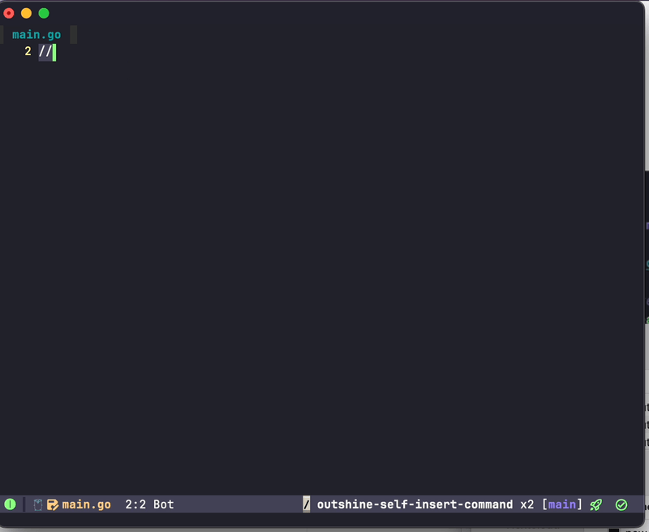
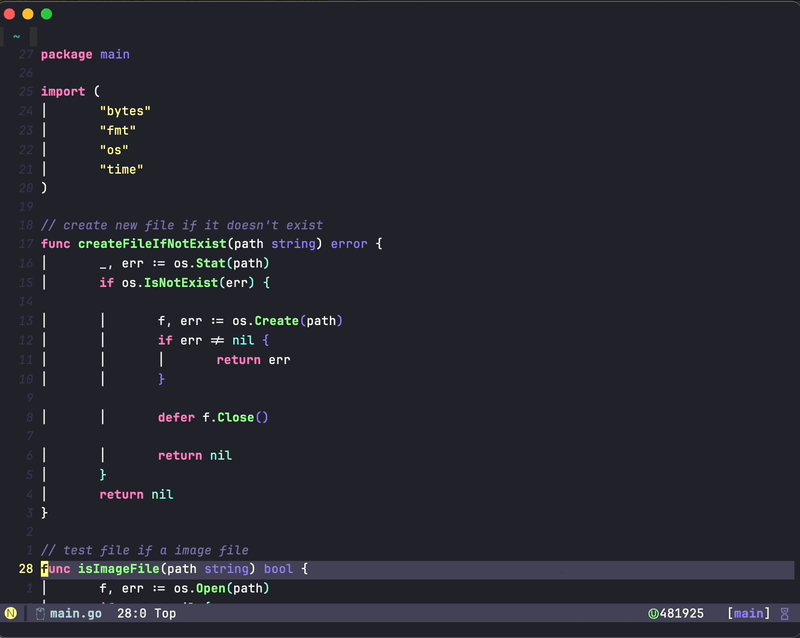
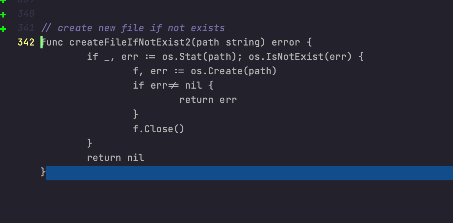
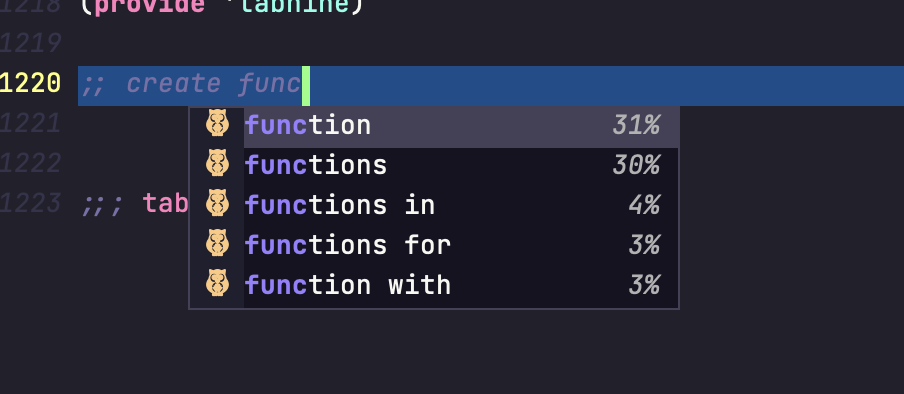

# tabnine

An unofficial TabNine(with TabNine Chat supported) package for Emacs.

# Screen Recording

- TabNine complete



- TabNine Chat



## Screenshot

- Snippets displayed with overlay, screenshot:



- Classic completions displayed with `completion-at-point-functions` screenshot (corfu)



## Installation

### straight-use-package

Add following code to your configuration.

```emacs
(use-package tabnine
  :hook (prog-mode . tabnine-mode)
  :straight (:host github :repo "shuxiao9058/tabnine")
  :hook (kill-emacs . tabnine-kill-process)
  :config
  (add-to-list 'completion-at-point-functions #'tabnine-completion-at-point))
```

### manully

1. Install `tabnine`.

   Clone or download this repository.

   Add to your load path:

   ```emacs
   (add-to-list 'load-path "<path-to-tabnine>")
   (require 'tabnine)
   ```

2. Enable `tabnine-mode` in `prog-mode`.

   ```emacs
   (add-to-list 'prog-mode-hook #'tabnine-mode)
   ```

3. Run `M-x tabnine-install-binary` to install the TabNine binary for your system.

4. Recommend shortcut binding

```emacs
(define-key tabnine-completion-map (kbd "TAB") #'tabnine-accept-completion)
(define-key tabnine-completion-map (kbd "<tab>") #'tabnine-accept-completion)

(define-key tabnine-completion-map (kbd "M-f") #'tabnine-accept-completion-by-word)
(define-key tabnine-completion-map (kbd "M-<return>") #'tabnine-accept-completion-by-line)

(define-key tabnine-completion-map (kbd "C-g") #'tabnine-clear-overlay)
(define-key tabnine-completion-map (kbd "M-[") #'tabnine-next-completion)
(define-key tabnine-completion-map (kbd "M-]") #'tabnine-previous-completion)

```

5. Example of configure with `use-package`.

```emacs-lisp
(use-package tabnine
  :commands (tabnine-start-process)
  :hook (prog-mode . tabnine-mode)
  :straight (tabnine :package "tabnine"
		     :type git
		     :host github :repo "shuxiao9058/tabnine")
  :diminish "⌬"
  :custom
  (tabnine-wait 1)
  (tabnine-minimum-prefix-length 0)
  :hook (kill-emacs . tabnine-kill-process)
  :config
  (add-to-list 'completion-at-point-functions #'tabnine-completion-at-point)
  (tabnine-start-process)
  :bind
  (:map  tabnine-completion-map
	 ("<tab>" . tabnine-accept-completion)
	 ("TAB" . tabnine-accept-completion)
	 ("M-f" . tabnine-accept-completion-by-word)
	 ("M-<return>" . tabnine-accept-completion-by-line)
	 ("C-g" . tabnine-clear-overlay)
	 ("M-[" . tabnine-previous-completion)
	 ("M-]" . tabnine-next-completion)))
```

### Auto-balance parentheses

TabNine can automatically balance parentheses, by removing and adding closing parentheses after the cursor. See the examples [here](https://github.com/zxqfl/TabNine/blob/master/HowToWriteAClient.md).

### ICON displayed error

If candidate icons of tabnine displayed unnormally [capf icon error](https://github.com/shuxiao9058/tabnine/issues/1), try set `kind-icon-mapping` for tabnine:

- With all-the-icons

```emacs-lisp
(add-to-list 'kind-icon-mapping '(tabnine "ai" :icon "cloud" :face shadow) t)
```

- With all-the-icons-nerd-fonts

```emacs-lisp
(add-to-list 'kind-icon-mapping `(tabnine ,(nerd-icons-codicon "nf-cod-hubot") :face font-lock-warning-face) t)
```

## TabNine Chat

TabNine Chat is still in BETA - to join the BETA - send `Tabnine Pro` email to `support@tabnine.com` to join BETA test.

| Command                             | Note                                          |
| ----------------------------------- | --------------------------------------------- |
| tabnine-chat-explain-code           | Explain the selected code                     |
| tabnine-chat-generate-test-for-code | Write tests for the selected code             |
| tabnine-chat-document-code          | Add documentation for the selected code       |
| tabnine-chat-fix-code               | Find errors in the selected code and fix them |
|                                     |                                               |


## Default key bindings

### tabnine-mode-map

None.

### tabnine-completion-map

| Key          | action                            |
| ------------ | --------------------------------- |
| TAB          | tabnine-accept-completion         |
| C-g          | tabnine-clear-overlay             |
| M-f          | tabnine-accept-completion-by-word |
| M-\<return\> | tabnine-accept-completion-by-line |
| M-[          | tabnine-previous-completion       |
| M-]          | tabnine-next-completion           |

## Known Issues

- TabNine's local deep learning completion might be enabled by default. It is very CPU-intensive if your device can't handle it. You can check by typing "TabNine::config" in any buffer (your browser should then automatically open to TabNine's config page) and disable Deep TabNine Local (you will lose local deep learning completion).

## Thanks

Thanks to the great work of [Tommy Xiang](https://github.com/TommyX12), [zerolfx](https://github.com/zerolfx/copilot.el) and [karthink](https://github.com/karthink).

These projects helped me a lot:

https://github.com/TommyX12/company-tabnine

https://github.com/50ways2sayhard/tabnine-capf

https://github.com/zerolfx/copilot.el

https://github.com/karthink/gptel
